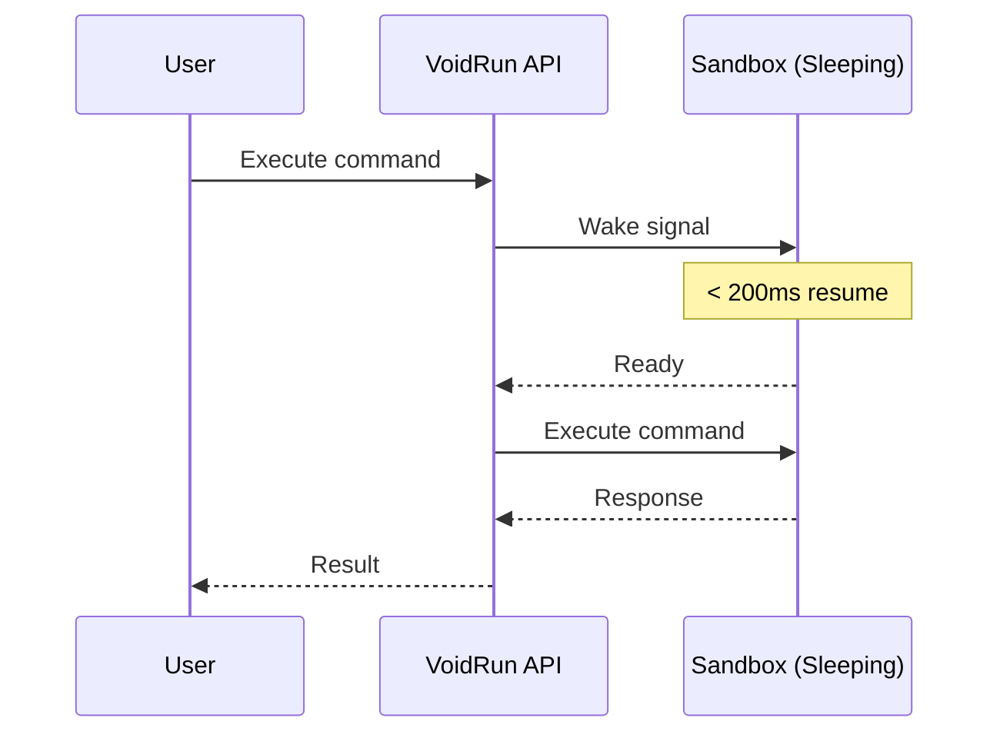

# Sandbox Lifecycle

VoidRun sandboxes are designed for long-running workloads with intelligent resource management. Unlike traditional serverless functions that timeout, VoidRun sandboxes can run indefinitely while optimizing costs through smart hibernation.

## Infinite Running

VoidRun sandboxes are designed to run forever. There's no maximum execution time limit, making them ideal for:

- Long-running AI agent workflows
- Persistent development environments
- Multi-step code execution pipelines
- Background processing tasks

<CardGroup cols={3}>
  <Card title="♾️ No Timeouts" icon="infinity">
    Sandboxes don't have a maximum execution time. Run tasks for minutes, hours, or days.
  </Card>
  <Card title="💰 Cost Efficient" icon="sack-dollar">
    Auto-sleep ensures you only pay for active compute time, not idle time.
  </Card>
  <Card title="⚡ Instant Resume" icon="bolt">
    Resume sleeping sandboxes in under 200ms, maintaining the illusion of always-on availability.
  </Card>
</CardGroup>

## Auto-Sleep & Resume

VoidRun automatically optimizes resource usage by putting idle sandboxes to sleep.

### How Auto-Sleep Works

<Steps>
  <Step title="Activity Monitoring">
    VoidRun monitors sandbox activity (command execution, file operations, network requests).
  </Step>
  <Step title="Idle Detection">
    After **5 minutes** of inactivity, the sandbox enters sleep mode.
  </Step>
  <Step title="State Preservation">
    The sandbox state is preserved: files, environment variables, and running processes are saved.
  </Step>
  <Step title="Resource Release">
    Compute resources are released, reducing costs while the sandbox remains available.
  </Step>
</Steps>

<Note>
The 5-minute idle timeout is configurable at the organization level. Contact support to adjust this setting for your use case.
</Note>

### Lightning-Fast Resume

When you interact with a sleeping sandbox, it resumes automatically in **under 200ms**:

- **Transparent**: Resume happens automatically: no manual wake-up needed
- **Fast**: Sub-200ms resume time feels instantaneous
- **Stateful**: All files, environment variables, and configurations are preserved



### Resume Time Comparison

| Platform | Cold Start | Resume Time |
|----------|------------|-------------|
| **VoidRun** | ~2s (new sandbox) | **< 200ms** |
| AWS Lambda | ~1-5s | N/A |
| Traditional VMs | ~30-60s | ~10-30s |
| Containers | ~5-15s | ~2-5s |

## Manual Lifecycle Controls

Take full control over sandbox state with manual lifecycle operations.

### Pause a Sandbox

Manually pause a running sandbox to release resources while preserving state:

<CodeGroup>
```typescript TypeScript
import { VoidRun } from '@voidrun/sdk';

const vr = new VoidRun({ apiKey: process.env.VR_API_KEY });
const sandbox = await vr.getSandbox('sandbox-id');

// Pause the sandbox
await sandbox.pause();
console.log('Sandbox paused');
```

```python Python
from voidrun import VoidRun
import os

vr = VoidRun(api_key=os.environ.get("VR_API_KEY"))
sandbox = vr.get_sandbox("sandbox-id")
# Pause the sandbox
sandbox.pause()
print("Sandbox paused")
```

```bash CLI
# Pause a running sandbox
voidrun pause <sandbox-id>
```

```bash cURL
curl -X POST "https://platform.void-run.com/api/sandboxes/<sandbox-id>/pause" \
  -H "X-API-Key: $VR_API_KEY"
```
</CodeGroup>

### Resume a Sandbox

Resume a paused or sleeping sandbox:

<CodeGroup>
```typescript TypeScript
import { VoidRun } from '@voidrun/sdk';

const vr = new VoidRun({ apiKey: process.env.VR_API_KEY });
const sandbox = await vr.getSandbox('sandbox-id');

// Resume the sandbox (< 200ms)
await sandbox.resume();
console.log('Sandbox resumed and ready');
```

```python Python
from voidrun import VoidRun
import os

vr = VoidRun(api_key=os.environ.get("VR_API_KEY"))
sandbox = vr.get_sandbox("sandbox-id")
# Resume the sandbox (< 200ms)
sandbox.resume()
print("Sandbox resumed and ready")
```

```bash CLI
# Resume a paused/sleeping sandbox
voidrun resume <sandbox-id>
```

```bash cURL
curl -X POST "https://platform.void-run.com/api/sandboxes/<sandbox-id>/resume" \
  -H "X-API-Key: $VR_API_KEY"
```
</CodeGroup>

### Stop a Sandbox

Stop a running sandbox completely (stronger than pause):

<CodeGroup>
```typescript TypeScript
import { VoidRun } from '@voidrun/sdk';

const vr = new VoidRun({ apiKey: process.env.VR_API_KEY });
const sandbox = await vr.getSandbox('sandbox-id');

// Stop the sandbox
await sandbox.stop();
console.log('Sandbox stopped');
```

```python Python
from voidrun import VoidRun
import os

vr = VoidRun(api_key=os.environ.get("VR_API_KEY"))
sandbox = vr.get_sandbox("sandbox-id")
# Stop the sandbox
sandbox.stop()
print("Sandbox stopped")
```

```bash CLI
# Stop a running sandbox
voidrun stop <sandbox-id>
```

```bash cURL
curl -X POST "https://platform.void-run.com/api/sandboxes/<sandbox-id>/stop" \
  -H "X-API-Key: $VR_API_KEY"
```
</CodeGroup>

### Start a Sandbox

Start a stopped sandbox:

<CodeGroup>
```typescript TypeScript
import { VoidRun } from '@voidrun/sdk';

const vr = new VoidRun({ apiKey: process.env.VR_API_KEY });
const sandbox = await vr.getSandbox('sandbox-id');

// Start the sandbox
await sandbox.start();
console.log('Sandbox started');
```

```python Python
from voidrun import VoidRun
import os

vr = VoidRun(api_key=os.environ.get("VR_API_KEY"))
sandbox = vr.get_sandbox("sandbox-id")
# Start the sandbox
sandbox.start()
print("Sandbox started")
```

```bash CLI
# Start a stopped sandbox
voidrun start <sandbox-id>
```

```bash cURL
curl -X POST "https://platform.void-run.com/api/sandboxes/<sandbox-id>/start" \
  -H "X-API-Key: $VR_API_KEY"
```
</CodeGroup>

### Terminate a Sandbox

Permanently delete a sandbox and all its data:

<Warning>
Termination is permanent. All files, environment variables, and state will be lost. Make sure to download any important data before terminating.
</Warning>

<CodeGroup>
```typescript TypeScript
import { VoidRun } from '@voidrun/sdk';

const vr = new VoidRun({ apiKey: process.env.VR_API_KEY });
const sandbox = await vr.getSandbox('sandbox-id');

// Permanently delete the sandbox
await sandbox.remove();
console.log('Sandbox terminated');
```

```python Python
from voidrun import VoidRun
import os

vr = VoidRun(api_key=os.environ.get("VR_API_KEY"))
sandbox = vr.get_sandbox("sandbox-id")
# Permanently delete the sandbox
sandbox.remove()
print("Sandbox terminated")
```

```bash CLI
# Permanently delete a sandbox
voidrun delete <sandbox-id>
```

```bash cURL
curl -X DELETE "https://platform.void-run.com/api/sandboxes/<sandbox-id>" \
  -H "X-API-Key: $VR_API_KEY"
```
</CodeGroup>

## Lifecycle States

| State | Description | Billing | Resume Time |
|-------|-------------|---------|-------------|
| **Running** | Sandbox is active and processing | Billed at full rate | N/A |
| **Paused** | Manually paused, state preserved | Billed at reduced rate | < 200ms |
| **Sleeping** | Auto-slept due to inactivity | Not billed | < 200ms |
| **Stopped** | Manually stopped | Not billed | ~2s (cold start) |

## Best Practices

### Cost Optimization

<Note>
Let sandboxes auto-sleep when not in use. The sub-200ms resume time means there's virtually no latency penalty, while you save on compute costs.
</Note>

### Long-Running Workflows

For workflows that need to maintain state over long periods:

1. **Use persistent storage**: Critical data should be persisted to files or external storage
2. **Handle resume gracefully**: Design your code to handle potential pauses
3. **Use health checks**: Implement periodic health checks for critical long-running processes

### Example: Long-Running AI Agent

<CodeGroup>
```typescript TypeScript
import { VoidRun } from '@voidrun/sdk';

const vr = new VoidRun({ apiKey: process.env.VR_API_KEY });

async function runAIAgent() {
  // Create sandbox - will run indefinitely
  const sandbox = await vr.createSandbox({
    name: 'ai-agent-session',
    cpu: 4,
    mem: 4096
  });

  try {
    // Install dependencies
    await sandbox.exec({ command: 'pip install openai langchain' });

    // Upload agent code
    await sandbox.fs.uploadFile('/app/agent.py', agentCode);

    // Run the agent (can run for hours/days)
    const result = await sandbox.exec({
      command: 'python3 /app/agent.py',
      timeout: 86400 // 24 hours
    });

    console.log(result.data?.stdout);
  } finally {
    // Clean up when truly done
    await sandbox.remove();
  }
}
```

```python Python
from voidrun import VoidRun
import os

vr = VoidRun(api_key=os.environ.get("VR_API_KEY"))

def run_ai_agent():
    # Create sandbox - will run indefinitely
    sandbox = vr.create_sandbox(
        name="ai-agent-session",
        cpu=4,
        mem=4096
    )
    try:
        # Install dependencies
        sandbox.exec("pip install openai langchain")

        # Upload agent code
        sandbox.fs.upload_file("/app/agent.py", agent_code)

        # Run the agent (can run for hours/days)
        result = sandbox.exec(
            "python3 /app/agent.py",
            timeout=86400  # 24 hours
        )

        print(result.data.stdout)
    finally:
        # Clean up when truly done
        sandbox.remove()
```

```bash CLI
# Create sandbox for long-running agent
voidrun create --name ai-agent-session --cpu 4 --mem 4096

# Install dependencies
voidrun exec <sandbox-id> --command "pip install openai langchain"

# Upload agent code
voidrun fs upload <sandbox-id> --source ./agent.py --dest /app/agent.py

# Run the agent
voidrun exec <sandbox-id> --command "python3 /app/agent.py" --timeout 86400

# Clean up when done
voidrun delete <sandbox-id>
```

```bash cURL
# Create sandbox
curl -X POST "https://platform.void-run.com/api/sandboxes" \
  -H "X-API-Key: $VR_API_KEY" \
  -H "Content-Type: application/json" \
  -d '{"name":"ai-agent-session","cpu":4,"mem":4096}'

# The sandbox will auto-sleep after 5 min idle and resume on next request
```
</CodeGroup>

## Next Steps

<CardGroup cols={2}>
  <Card title="Code Execution" icon="terminal" href="/core-concepts/code-execution">
    Learn how to execute commands and code inside sandboxes.
  </Card>
  <Card title="File System" icon="folder" href="/core-concepts/file-system">
    Understand file storage and operations in sandboxes.
  </Card>
</CardGroup>
