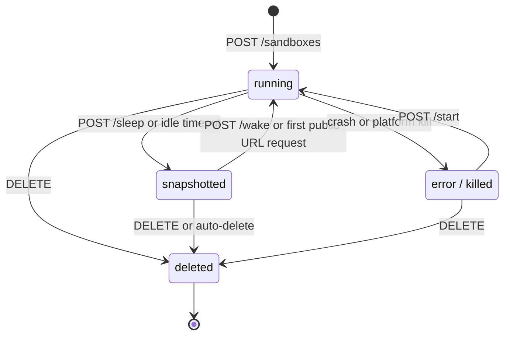

# Sandbox Lifecycle

VoidRun sandboxes are designed for long-running workloads with intelligent resource management. A running sandbox has no maximum execution time, and idle sandboxes are snapshotted to disk so you only pay for active compute. A snapshotted sandbox wakes in a fraction of a second on the next request.

## Infinite running

VoidRun sandboxes are designed to run for as long as you need. There is no maximum execution time, making them a good fit for:

- Long-running AI agent workflows
- Persistent development environments
- Multi-step code execution pipelines
- Background processing tasks

<CardGroup cols={3}>
  <Card title="No hard timeouts" icon="infinity">
    Run tasks for minutes, hours, or days. Idle sandboxes are snapshotted, not killed.
  </Card>
  <Card title="Cost efficient" icon="sack-dollar">
    Auto-sleep releases compute while a snapshot preserves the sandbox on disk.
  </Card>
  <Card title="Fast wake" icon="bolt">
    Wake a snapshotted sandbox in well under a second: the same sandbox, same files, same processes.
  </Card>
</CardGroup>

## Lifecycle states

The `status` field on a sandbox is one of:

| State | What it means | Billing | Next transitions |
|-------|---------------|---------|------------------|
| **`running`** | VM is up, guest agent is reachable | Full compute rate | `sleep` → `snapshotted`, crash → `error`, delete → `deleted` |
| **`snapshotted`** | VM process exited, memory + disk snapshot on host | Storage only | `wake` / `start` / public URL request → `running`, delete → `deleted`, auto-delete after retention |
| **`error`** | VM entered a bad state or crashed | Storage only | `start` → `running`, delete → `deleted` |
| **`killed`** | VM was terminated by the platform (rare) | Storage only | `start` → `running`, delete → `deleted` |
| **`deleted`** | Terminal. Disks and metadata scheduled for cleanup | Not billed | — |


```mermaid
stateDiagram-v2
    state "running" as running
    state "snapshotted" as snapshotted
    state "error / killed" as recovery
    state "deleted" as deleted

    [*] --> running: POST /sandboxes
    running --> snapshotted: POST /sleep or idle timeout
    snapshotted --> running: POST /wake or first public URL request
    running --> recovery: crash or platform kill
    recovery --> running: POST /start
    running --> deleted: DELETE
    snapshotted --> deleted: DELETE or auto-delete
    recovery --> deleted: DELETE
    deleted --> [*]
```

## Auto-sleep and auto-delete

When you pass `autoSleep: true` on create, the platform manages the lifecycle for you. You can change `autoSleep` later with `PATCH /sandboxes/{id}`:

```bash
curl -X PATCH "https://api.void-run.com/api/sandboxes/<sandbox-id>" \
  -H "X-API-Key: $VR_API_KEY" \
  -H "Content-Type: application/json" \
  -d '{"autoSleep":false}'
```

```typescript TypeScript
await sandbox.update({ autoSleep: false });
```

```python Python
sandbox.update(auto_sleep=False)
```

The flag is stored on the sandbox document. The next auto-lifecycle scan (default every 30 seconds) picks it up; the VM is not restarted. `autoSleep: false` skips idle snapshot only. It does **not** stop auto-delete of a sandbox that is already `snapshotted`.

<Steps>
  <Step title="Activity monitoring">
    The platform treats sandbox **API requests** (for example `exec`, filesystem calls, and opening a PTY) as activity. An open terminal connection alone does **not** keep the sandbox awake; see [PTY](/core-concepts/pty#auto-sleep-interaction).
  </Step>
  <Step title="Auto-sleep (default: 1 minute idle)">
    After the configured idle window, the sandbox is snapshotted: memory + disk are persisted and the VM process exits. Status becomes `snapshotted`.
  </Step>
  <Step title="Auto-wake on demand">
    The next API call (or public URL request) transparently wakes the sandbox back into `running`. You do not need to poll or issue a wake call yourself.
  </Step>
  <Step title="Auto-delete (default: 7 days snapshotted)">
    A sandbox that stays `snapshotted` past the retention window is deleted, and its snapshot is removed. Download anything you need before you leave a sandbox idle for that long.
  </Step>
</Steps>

### Defaults

| Threshold | Default | Env variable (self-hosted) |
|-----------|---------|----------------------------|
| Auto-snapshot after idle | **60 seconds** | `AUTO_LIFECYCLE_SNAPSHOT_AFTER_IDLE_SEC` |
| Auto-delete after snapshotted | **7 days** (604800 s) | `AUTO_LIFECYCLE_DELETE_AFTER_SNAPSHOTTED_SEC` |
| Check interval | **30 seconds** | `AUTO_LIFECYCLE_CHECK_INTERVAL_SEC` |

<Note>
These are hosted-VoidRun defaults. On self-hosted deployments, tune the environment variables above and disable the whole loop with `AUTO_LIFECYCLE_ENABLED=false` if you want per-sandbox opt-in only.
</Note>

<Warning>
An open **PTY** connection does not count as continuous activity. After you connect, idle time still advances unless other API calls keep the sandbox active. Details: [PTY → Auto-sleep interaction](/core-concepts/pty#auto-sleep-interaction).
</Warning>

### Wake is transparent

You don't have to call `wake` yourself to use a snapshotted sandbox. Every path that talks to the guest does the right thing:

- **REST API and SDKs**: an `exec`, filesystem, or command call against a `snapshotted` sandbox triggers a wake and then executes.
- **Public URLs**: a request to a published port while `snapshotted` wakes the sandbox through the gateway and then proxies the request. See [Public URLs](/networking/public-urls).

The first request after a long idle pays the wake cost once (memory + disk restore + readiness probe). Subsequent requests are hot.

## Manual lifecycle controls

You can drive the lifecycle explicitly.

### Sleep a sandbox

Snapshot a running sandbox now, instead of waiting for the idle timer.

<CodeGroup>
```typescript TypeScript
import { VoidRun } from '@voidrun/sdk';

const vr = new VoidRun({ apiKey: process.env.VR_API_KEY });
const sandbox = await vr.getSandbox('sandbox-id');

await sandbox.sleep();
console.log('Sandbox snapshotted');
```

```python Python
from voidrun import VoidRun
import os

vr = VoidRun(api_key=os.environ.get("VR_API_KEY"))
sandbox = vr.get_sandbox("sandbox-id")
sandbox.sleep()
print("Sandbox snapshotted")
```

```bash cURL
curl -X POST "https://api.void-run.com/api/sandboxes/<sandbox-id>/sleep" \
  -H "X-API-Key: $VR_API_KEY"
```
</CodeGroup>

### Wake a sandbox

Explicitly restore a `snapshotted` sandbox back to `running`. In most cases you don't need this: any API call against a snapshotted sandbox auto-wakes it.

<CodeGroup>
```typescript TypeScript
import { VoidRun } from '@voidrun/sdk';

const vr = new VoidRun({ apiKey: process.env.VR_API_KEY });
const sandbox = await vr.getSandbox('sandbox-id');

await sandbox.wake();
console.log('Sandbox running');
```

```python Python
from voidrun import VoidRun
import os

vr = VoidRun(api_key=os.environ.get("VR_API_KEY"))
sandbox = vr.get_sandbox("sandbox-id")
sandbox.wake()
print("Sandbox running")
```

```bash cURL
curl -X POST "https://api.void-run.com/api/sandboxes/<sandbox-id>/wake" \
  -H "X-API-Key: $VR_API_KEY"
```
</CodeGroup>

### Start a recovered sandbox

`start` is for recovery: it accepts sandboxes in `snapshotted`, `killed`, or `error` and boots them from the latest snapshot. Use `wake` for the normal sleep/wake loop and reach for `start` when the platform reports the sandbox in a non-running, non-snapshotted state.

<CodeGroup>
```typescript TypeScript
import { VoidRun } from '@voidrun/sdk';

const vr = new VoidRun({ apiKey: process.env.VR_API_KEY });
const sandbox = await vr.getSandbox('sandbox-id');

await sandbox.start();
```

```python Python
from voidrun import VoidRun
import os

vr = VoidRun(api_key=os.environ.get("VR_API_KEY"))
sandbox = vr.get_sandbox("sandbox-id")
sandbox.start()
```

```bash cURL
curl -X POST "https://api.void-run.com/api/sandboxes/<sandbox-id>/start" \
  -H "X-API-Key: $VR_API_KEY"
```
</CodeGroup>

<Note>
`start` fails with 500 if no snapshot is available. That usually means the sandbox never reached `running` after create, or the snapshot was cleaned up: create a fresh sandbox in that case.
</Note>

### Delete a sandbox

Permanently remove a sandbox, its snapshot, and all its data.

<Warning>
Deletion is permanent. Files, environment variables, and any snapshot are destroyed. Download important data first.
</Warning>

<CodeGroup>
```typescript TypeScript
import { VoidRun } from '@voidrun/sdk';

const vr = new VoidRun({ apiKey: process.env.VR_API_KEY });
const sandbox = await vr.getSandbox('sandbox-id');

await sandbox.remove();
```

```python Python
from voidrun import VoidRun
import os

vr = VoidRun(api_key=os.environ.get("VR_API_KEY"))
sandbox = vr.get_sandbox("sandbox-id")
sandbox.remove()
```

```bash cURL
curl -X DELETE "https://api.void-run.com/api/sandboxes/<sandbox-id>" \
  -H "X-API-Key: $VR_API_KEY"
```
</CodeGroup>

## Public URL cold wake

Sandboxes that expose ports via `publishPorts` remain reachable while `snapshotted`. A request to a published URL is served after the gateway wakes the sandbox: the first request after idle is slower, and subsequent requests are hot. Design HTTP clients to retry once on a gateway timeout during that first request.

See [Public URLs](/networking/public-urls) for how to publish ports and fetch the URLs.

## Best practices

### Let sandboxes sleep

Sandboxes with `autoSleep: true` cost storage only while snapshotted. Wake latency is well under a second, so the user-visible penalty is minimal for interactive workflows.

### Design long-running workflows for wake

For workflows that live for hours or days:

1. **Persist state to disk** — files inside the sandbox survive sleep/wake. State kept only in a process's memory does not: on wake, that process no longer exists.
2. **Detect status** — before assuming the sandbox is hot, read the current status (`GET /sandboxes/{id}`); the SDKs expose `sandbox.status`.
3. **Retry idempotent calls** — the first request after a long idle can hit the wake budget; retry once with a small backoff on gateway timeouts.

### Long-running AI agent example

<CodeGroup>
```typescript TypeScript
import { VoidRun } from '@voidrun/sdk';

const vr = new VoidRun({ apiKey: process.env.VR_API_KEY });

async function runAIAgent() {
  const sandbox = await vr.createSandbox({
    name: 'ai-agent-session',
    cpu: 4,
    mem: 4096,
    autoSleep: true,
  });

  try {
    await sandbox.exec({ command: 'pip install openai langchain' });
    await sandbox.fs.uploadFile('/app/agent.py', agentCode);

    const result = await sandbox.exec({
      command: 'python3 /app/agent.py',
      timeout: 86400,
    });

    console.log(result.data?.stdout);
  } finally {
    await sandbox.remove();
  }
}
```

```python Python
from voidrun import VoidRun
import os

vr = VoidRun(api_key=os.environ.get("VR_API_KEY"))

def run_ai_agent():
    sandbox = vr.create_sandbox(
        name="ai-agent-session",
        cpu=4,
        mem=4096,
        auto_sleep=True,
    )
    try:
        sandbox.exec("pip install openai langchain")
        sandbox.fs.upload_file("/app/agent.py", agent_code)
        result = sandbox.exec(
            "python3 /app/agent.py",
            timeout=86400,
        )
        print(result.data.stdout)
    finally:
        sandbox.remove()
```

```bash cURL
# Create with autoSleep so the platform snapshots on idle
curl -X POST "https://api.void-run.com/api/sandboxes" \
  -H "X-API-Key: $VR_API_KEY" \
  -H "Content-Type: application/json" \
  -d '{"name":"ai-agent-session","cpu":4,"mem":4096,"autoSleep":true}'

# Later requests auto-wake the sandbox if it snapshotted while idle
```
</CodeGroup>

## Next steps

<CardGroup cols={2}>
  <Card title="Public URLs" icon="globe" href="/networking/public-urls">
    Publish sandbox ports and reach them from the internet.
  </Card>
  <Card title="Code Execution" icon="terminal" href="/core-concepts/code-execution">
    Run commands and code inside a sandbox.
  </Card>
  <Card title="File System" icon="folder" href="/core-concepts/file-system">
    Files persist across sleep/wake and only vanish on delete.
  </Card>
  <Card title="SDKs & API" icon="code" href="/sdks/overview">
    TypeScript and Python method surface for the lifecycle.
  </Card>
</CardGroup>
